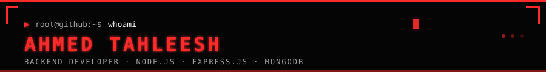
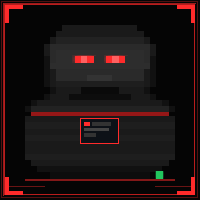

<!--
╔══════════════════════════════════════════════════════════════╗
║  GitHub Profile README — Ahmed Tahleesh (@Tahleesh)          ║
║  username: Tahleesh  ·  configured and ready to push         ║
╚══════════════════════════════════════════════════════════════╝
-->

<div align="center">



</div>

<br/>

---

<div align="center">

<!-- ██████████████████  HERO SECTION  ██████████████████ -->

<table>
<tr>
<td width="38%" align="center" valign="top">

<!-- ── PIXEL AVATAR ── -->


<br/>

<!-- Status badges under avatar -->


<br/><br/>

<!-- Animated visitor counter -->


</td>
<td width="62%" align="left" valign="middle" style="padding-left: 20px;">

<!-- ── TERMINAL INTRO ── -->
```
root@github:~$ whoami
```

<h1 align="left">
  
</h1>


<br/>

<table>
<tr>
<td></td>
</tr>
<tr>
<td></td>
</tr>
<tr>
<td></td>
</tr>
</table>

<br/>

```bash
$ cat connect.txt

  GitHub   →  github.com/Tahleesh
  LinkedIn →  linkedin.com/in/<!-- UPDATE: your LinkedIn handle -->
  Email    →  <!-- UPDATE: your email address -->

[EOF]
```

</td>
</tr>
</table>

</div>

<div align="center">

</div>

---

<!-- ██████████████████  PIXEL AVATAR FEATURES  ██████████████████ -->

<div align="center">

```
┌─────────────────────────────────────────────────────────────────┐
│  [01]  PIXEL AVATAR FEATURES                                     │
└─────────────────────────────────────────────────────────────────┘
```

<table>
<tr>
<td align="center" width="18%">

<br/><sub><code>Eyes animate on activity</code></sub>
</td>
<td align="center" width="18%">

<br/><sub><code>Red glow on hover</code></sub>
</td>
<td align="center" width="18%">

<br/><sub><code>Snake commit effect</code></sub>
</td>
<td align="center" width="18%">

<br/><sub><code>SVG pixel grid build</code></sub>
</td>
<td align="center" width="18%">

<br/><sub><code>Animated SVG states</code></sub>
</td>
</tr>
</table>

</div>

---

<!-- ██████████████████  LIVE PIXEL AVATAR STATES  ██████████████████ -->

<div align="center">

```
┌─────────────────────────────────────────────────────────────────┐
│  [02]  LIVE PIXEL AVATAR — INTERACTIVE STATES                    │
└─────────────────────────────────────────────────────────────────┘
```

<table>
<tr>
<td align="center" width="25%">

```
┌──────────┐
│  > IDLE  │
│          │
│  ◉  ◉   │
│    ──    │
│  ██████  │
└──────────┘
```
<br/>

<br/><sub><code>Waiting for input...</code></sub>

</td>
<td align="center" width="25%">

```
┌──────────┐
│  > BLINK │
│          │
│  ─  ─   │
│    ──    │
│  ██████  │
└──────────┘
```
<br/>

<br/><sub><code>Eyes closed briefly</code></sub>

</td>
<td align="center" width="25%">

```
┌──────────┐
│ > COMMIT │
│          │
│  ◈  ◈   │
│    >>    │
│  ██████  │
└──────────┘
```
<br/>

<br/><sub><code>git push origin main</code></sub>

</td>
<td align="center" width="25%">

```
┌──────────┐
│  > HOVER │
│          │
│  ◉  ◉   │
│  ~~~~~~  │
│  ██████  │
└──────────┘
```
<br/>

<br/><sub><code>Cursor detected</code></sub>

</td>
</tr>
</table>

</div>

---

<!-- ██████████████████  TECH STACK  ██████████████████ -->

<div align="center">

```
┌─────────────────────────────────────────────────────────────────┐
│  [03]  TECH STACK :: PRIMARY SYSTEMS                             │
└─────────────────────────────────────────────────────────────────┘
```

<!-- Backend Runtime -->
<p>


</p>

<!-- Languages -->
<p>


</p>

<!-- DevOps / Tools -->
<p>


</p>

<br/>

<!-- Proficiency matrix -->
<table>
<tr>
<th align="left"><code>RUNTIME</code></th>
<th align="left"><code>PROFICIENCY</code></th>
<th align="left"><code>LEVEL</code></th>
</tr>
<tr>
<td><code>Node.js</code></td>
<td><code>████████████████████</code></td>
<td></td>
</tr>
<tr>
<td><code>Express.js</code></td>
<td><code>████████████████████</code></td>
<td></td>
</tr>
<tr>
<td><code>MongoDB</code></td>
<td><code>████████████████░░░░</code></td>
<td></td>
</tr>
<tr>
<td><code>JavaScript</code></td>
<td><code>████████████████████</code></td>
<td></td>
</tr>
<tr>
<td><code>Python</code></td>
<td><code>████████████░░░░░░░░</code></td>
<td></td>
</tr>
<tr>
<td><code>Docker</code></td>
<td><code>█████████████░░░░░░░</code></td>
<td></td>
</tr>
<tr>
<td><code>Linux</code></td>
<td><code>██████████████░░░░░░</code></td>
<td></td>
</tr>
</table>

</div>

---

<!-- ██████████████████  CURRENT FOCUS  ██████████████████ -->

<div align="center">

```
┌─────────────────────────────────────────────────────────────────┐
│  [04]  CURRENT FOCUS :: ACTIVE SYSTEMS                           │
└─────────────────────────────────────────────────────────────────┘
```

<table>
<tr>
<td align="center" width="20%">

</td>
<td align="center" width="20%">

</td>
<td align="center" width="20%">

</td>
<td align="center" width="20%">

</td>
<td align="center" width="20%">

</td>
</tr>
</table>

</div>

---

<!-- ██████████████████  GITHUB STATS  ██████████████████ -->

<div align="center">

```
┌─────────────────────────────────────────────────────────────────┐
│  [05]  GITHUB STATS :: PERFORMANCE METRICS                       │
└─────────────────────────────────────────────────────────────────┘
```

<table>
<tr>
<td align="center" width="50%">

<!-- GitHub Stats Card -->


</td>
<td align="center" width="50%">

<!-- GitHub Streak -->


</td>
</tr>
</table>

<!-- Profile Summary Cards -->


</div>

---

<!-- ██████████████████  TOP LANGUAGES  ██████████████████ -->

<div align="center">

```
┌─────────────────────────────────────────────────────────────────┐
│  [06]  TOP LANGUAGES :: CODE DISTRIBUTION                        │
└─────────────────────────────────────────────────────────────────┘
```

<table>
<tr>
<td align="center" width="50%">

<!-- Top Languages Card (real GitHub data) -->


</td>
<td align="left" width="50%" valign="top">

```
LANGUAGE DISTRIBUTION
─────────────────────────────────────

JavaScript  ████████████████████ live
Python      ██████░░░░░░░░░░░░░░ live
Shell       ████░░░░░░░░░░░░░░░░ live
Dockerfile  ███░░░░░░░░░░░░░░░░░ live
Other       ██░░░░░░░░░░░░░░░░░░ live

> Data sourced from GitHub API
> Updated on every profile visit
```

</td>
</tr>
</table>

</div>

---

<!-- ██████████████████  TROPHIES  ██████████████████ -->

<div align="center">

```
┌─────────────────────────────────────────────────────────────────┐
│  [07]  ACHIEVEMENTS :: UNLOCKED                                  │
└─────────────────────────────────────────────────────────────────┘
```


</div>

---

<!-- ██████████████████  SNAKE CONTRIBUTION GRAPH  ██████████████████ -->

<div align="center">

```
┌─────────────────────────────────────────────────────────────────┐
│  [08]  SNAKE EATING MY CONTRIBUTIONS                             │
└─────────────────────────────────────────────────────────────────┘
```

> 🐍 *The snake is generated automatically by GitHub Actions every day.*

<picture>
  <source media="(prefers-color-scheme: dark)" srcset="https://raw.githubusercontent.com/Tahleesh/Tahleesh/output/snake-dark.svg"/>
  <source media="(prefers-color-scheme: light)" srcset="https://raw.githubusercontent.com/Tahleesh/Tahleesh/output/snake.svg"/>
  
</picture>

</div>

---

<!-- ██████████████████  VISITOR COUNTER  ██████████████████ -->

<div align="center">

```
┌─────────────────────────────────────────────────────────────────┐
│  [09]  VISITOR COUNTER                                           │
└─────────────────────────────────────────────────────────────────┘
```

<table>
<tr>
<td align="center">
<code>PROFILE VIEWS</code>
<br/>

<br/>

</td>
</tr>
</table>

</div>

---

<!-- ██████████████████  RANDOM DEV QUOTE  ██████████████████ -->

<div align="center">

```
┌─────────────────────────────────────────────────────────────────┐
│  [10]  RANDOM DEV QUOTE                                          │
└─────────────────────────────────────────────────────────────────┘
```


<br/>

> *"The best error message is the one that never shows up."*
> — Thomas Fuchs

</div>

---

<!-- ██████████████████  NOW PLAYING  ██████████████████ -->

<div align="center">

```
┌─────────────────────────────────────────────────────────────────┐
│  [11]  NOW PLAYING                                               │
└─────────────────────────────────────────────────────────────────┘
```

<table>
<tr>
<td align="center" width="100%">

```
╔══════════════════════════════════════════════════╗
║  🎵  NOW PLAYING                                 ║
║  ─────────────────────────────────────────────  ║
║  ♪  Lofi Beats                                  ║
║     Chill Programmer Mix                         ║
║                                                  ║
║  ████████████████░░░░░░░░  2:34 / 3:47           ║
║                                                  ║
║  ⏮   ⏪   ▶   ⏩   ⏭                             ║
╚══════════════════════════════════════════════════╝
```

<sub>
<i>Connect real Spotify — see <a href="#setup-guide">Setup Guide</a> below.</i>
</sub>

<!-- OPTIONAL: If you connect novatorem/spotify-github-profile, replace the block above with:

-->

</td>
</tr>
</table>

</div>

---

<!-- ██████████████████  HOW TO EMBED WIDGETS  ██████████████████ -->

<div align="center">

```
┌─────────────────────────────────────────────────────────────────┐
│  [12]  HOW TO ADD TO YOUR README                                 │
└─────────────────────────────────────────────────────────────────┘
```

</div>

**Pixel Avatar**
```markdown

```

**GitHub Stats**
```markdown

```

**Contribution Snake**
```markdown

```

**Visitor Counter**
```markdown

```

---

<!-- ██████████████████  BOTTOM / FEATURES  ██████████████████ -->

<div align="center">

```
┌─────────────────────────────────────────────────────────────────┐
│  [13]  FEATURES & DEPLOYMENT                                     │
└─────────────────────────────────────────────────────────────────┘
```

<table>
<tr>
<td>

```
  🌐  Deploy the API on Vercel / Render
  ☁️   Stats update on every visit (live)
  🚀  Snake auto-generated by GitHub Actions
  ✨  Fully customizable color system
  🎨  Pixel-art retro terminal aesthetic
  🔴  Red / black cyberpunk color scheme
```

</td>
</tr>
</table>

---

<!-- Social / Contact -->

```
┌─────────────────────────────────────────────────────────────────┐
│  CONNECT                                                         │
└─────────────────────────────────────────────────────────────────┘
```

<a href="https://github.com/Tahleesh">
  
</a>
&nbsp;
<a href="https://linkedin.com/in/YOUR_LINKEDIN_USERNAME">
  
</a>
&nbsp;
<a href="mailto:YOUR_EMAIL@example.com">
  
</a>

---

<sub>
Made with <code>⬛ #050505</code> + <code>🔴 #FF2B2B</code> · Backend Developer · Palestine 🇵🇸
</sub>

</div>

---

<!-- ██████████████████  SETUP GUIDE  ██████████████████ -->

<details>
<summary><b>⚙️ Setup Guide — click to expand</b></summary>

<br/>

### 1. Remaining placeholders

GitHub username is already configured as **`Tahleesh`**. You only need to update two things:

| Placeholder | Replace with |
|-------------|-------------|
| `YOUR_LINKEDIN_USERNAME` | your LinkedIn profile handle |
| `YOUR_EMAIL@example.com` | your contact email address |

### 2. Enable GitHub Actions (Snake)

1. Go to **Settings → Actions → General**
2. Set *Workflow permissions* to **"Read and write permissions"**
3. Push this repo — the `snake.yml` workflow will run and create an `output` branch automatically

### 3. Optional: Real Spotify integration

To show your real currently-playing track:

1. Deploy [novatorem/spotify-github-profile](https://github.com/novatorem/spotify-github-profile) to Vercel
2. Add these GitHub secrets: `CLIENT_ID`, `CLIENT_SECRET`, `REFRESH_TOKEN`
3. Replace the static "Now Playing" block in Section 11 with:
```markdown
[](https://open.spotify.com)
```

### 4. Push to GitHub

```bash
git init
git add .
git commit -m "feat: pixel-art profile README"
git branch -M main
git remote add origin git@github.com:Tahleesh/Tahleesh.git
git push -u origin main
```

> **Note:** The repo name must match your GitHub username exactly for it to appear as your profile README.

</details>

<div align="center">

<br/>
<sub><code>root@github:~$ exit</code></sub>
</div>
